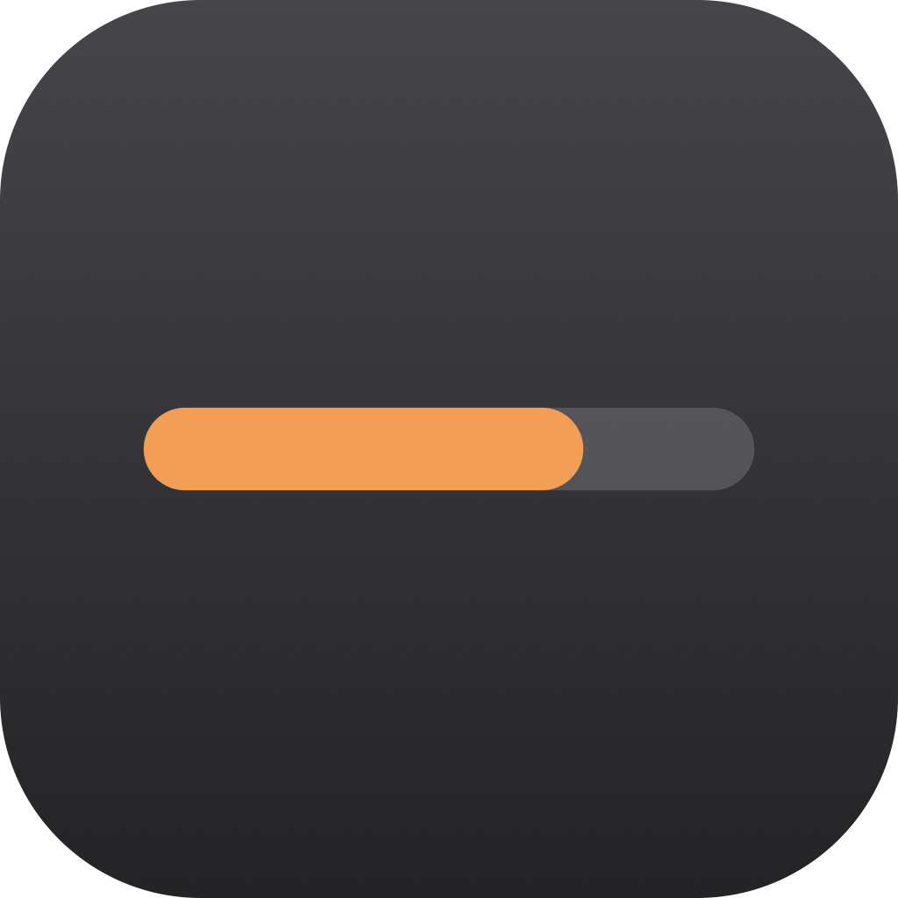
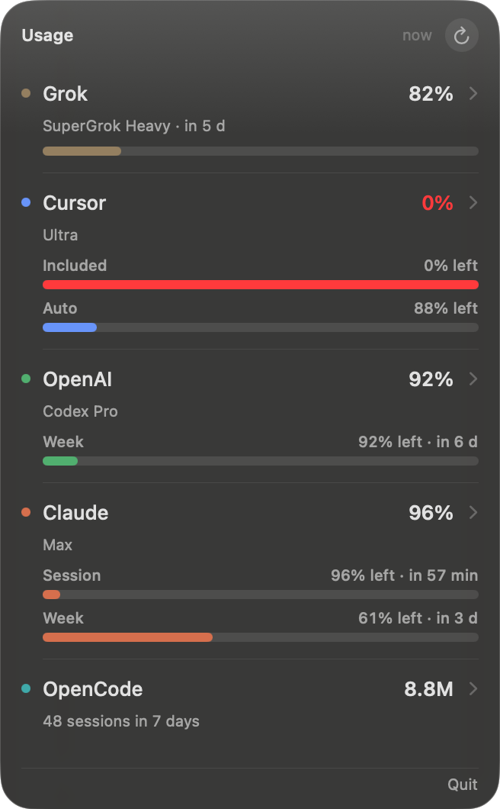

<p align="center">
  
</p>

# Uso

Menu bar app for macOS. It shows what is left on Grok, Cursor, Codex, Claude, and OpenCode.

The menu bar cycles through the accounts, about 3 seconds each. Claude shows the 5-hour window, then the week. Cursor shows included dollars, then Auto. Click the item to open the panel. Click anywhere else, or press Escape, to hide it. Open a row for the full breakdown.

<p align="center">
  
</p>

Requires macOS 14 or later on Apple silicon.

## Install

Download the latest zip from the [releases page](https://github.com/bujosa/uso/releases/latest).

1. Unzip the file. You get `Uso.app`.
2. Move `Uso.app` into Applications.
3. Open it. If macOS says the app cannot be checked, right-click `Uso.app`, choose Open, then Open again.
4. Look in the menu bar. The label cycles through each account.

The app does not show a Dock icon. Quit it from the panel.

Claude Code stores its session in the login keychain. The first time you want that row, open Claude and choose Allow access. Uso then keeps a private copy and uses it on later refreshes, so macOS does not ask every few minutes. Choose Always Allow if you want the renewal, hours later, to stay silent too.

## From source

```sh
./scripts/install.sh
```

That builds a release binary, installs `~/Applications/Uso.app`, and opens it. `./scripts/package.sh` only writes `dist/Uso-1.0.5-macOS.zip`.

## What each row shows

- **Grok.** Weekly credits, plus Build, Imagine, Chat, and Voice when the account returns them.
- **Cursor.** Included dollars and Auto on the row. API usage and the token mix are inside the row. Auto is the pool for the other models.
- **Codex.** The weekly window is on the row. A shorter window, when the account has one, sits above it.
- **Claude.** Session and week are both on the row. A model week such as Fable, and the mix across Claude Code and the rest, are inside the row.
- **OpenCode.** Local tokens for today, the last 7 days, and all time. This is sessions on this Mac, not a plan quota. An OpenCode Go key adds the official quota.

Bars fill as usage goes up. Red means 90% or more used. Orange means 75% or more. The number on the row is what is left.

The panel refreshes when you open it, and again every 3 minutes. The refresh button forces a new read.

Open at login uses the macOS login item for this app.

## Where the numbers come from

Uso reads the session each tool already saved on this Mac. It does not ask you to paste an API key.

| Service | Local session | Usage endpoint |
| --- | --- | --- |
| Grok | `~/.grok/auth.json` | Grok CLI billing |
| Cursor | Cursor's local database | Cursor dashboard |
| Codex | `~/.codex/auth.json` | Codex usage |
| Claude | Login keychain item `Claude Code-credentials` | Claude OAuth usage |
| OpenCode | `opencode.db` on this Mac | OpenCode Go, only if that key is present |

Tokens stay in memory for the request. Uso does not write them to a log or to its own database.

## License

MIT. See [LICENSE](LICENSE).
